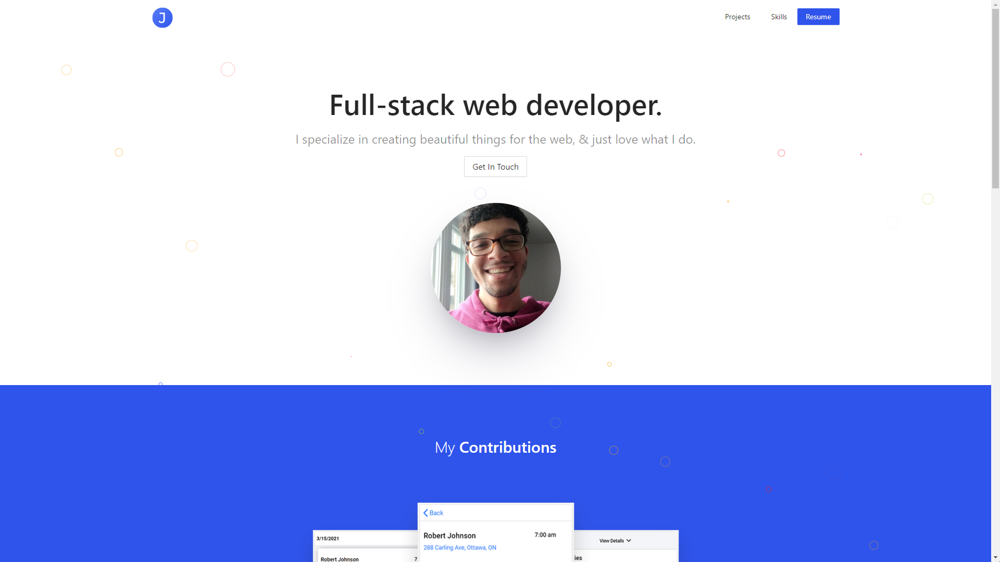

<h1 align="center"><a href="https://jonahlouis.ca/">jonahlouis.ca - V3</a></h1>

Third version of my <b>portfolio</b> made with <a href="https://ant.design/" target="_blank">Ant Design</a> & <a href="https://reactjs.org/docs/hooks-overview.html" target="_blank">React</a>.

## :ballot_box_with_check: Project Goals
 - Implement a **modern** & **fully responsive** website using **Ant Design**.
 - Familiarizing with React JS.
 - Experiment with <a href="https://www.framer.com/api/motion/" target="_blank">Framer motion</a>.

## :art: Main colours
All **main** colours are from [Ant Design](https://ant.design/docs/spec/colors).

| Colours	     | Code																	   |
|----------------|-------------------------------------------------------------------------|
| geekblue-6 (main)  | `#2f54eb`|
| black	(footer) | `#1f1f1f`|
| black (logos)	 | `#434343`|
